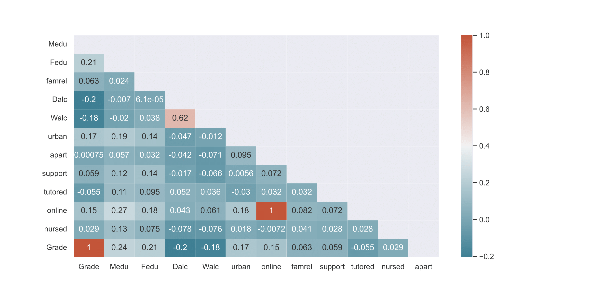
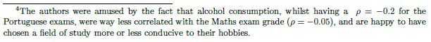
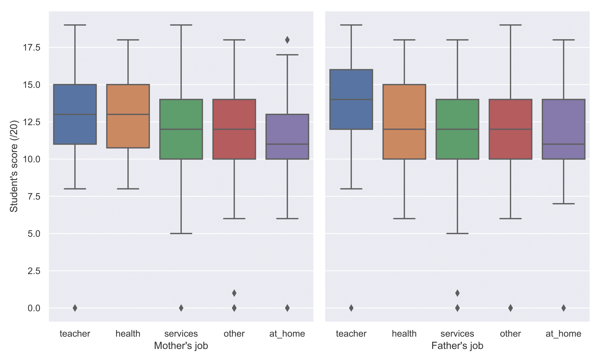
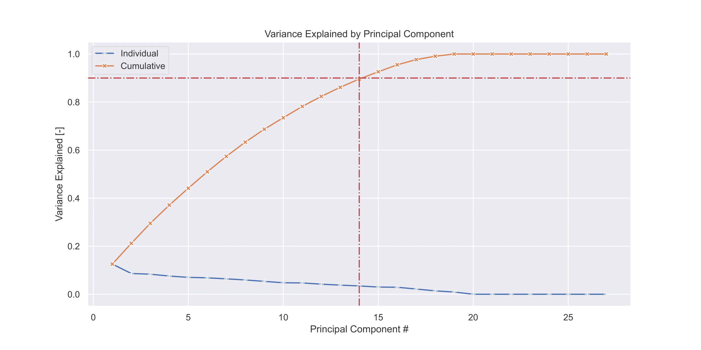
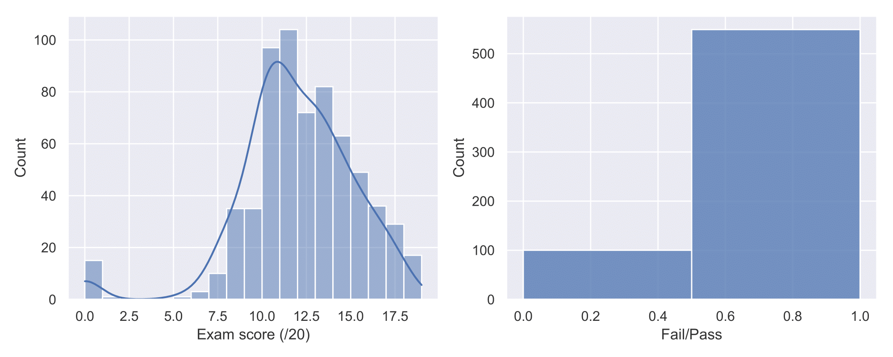

A project in which a set of socio-economic factors of high-school students in Portugal are investigated with their relation to the student's performance, potentially giving some advice to future parents who would like their children to perform well academically. Done as an assignment for the 'Introduction to Machine Learning & Data Mining' MSc course under DTU, with my classmate Mario Cesar Rodriguez.

Tl;dr: Want your child to (have a chance to statistically) perform well in school?
- Make sure both you and your spouse are educated (the more the better). Bonus points if you are both teachers. 
- Ensure that your child drinks alcohol as infrequently as possible (especially on workdays). 
- Situate yourself in an urban setting (i.e. close to school in this case).
- Provide your child with access to internet.

Two reports were made, the first one focusing on exploratory data analysis (data mining), and the second one on applying machine learning algorithms to the data. The main results of these are presented below, with a more thorough write-up featured in the `.pdf` files in this repo.

### 1 - Feature extraction and visualisation
We were free to choose our own dataset for this course. I chose this one, as my previous experience with machine learning allowed me to see that the future tasks (such as linear regression) would be possible with it. Also, the subject matter does not require much field-specific subject knowledge that would prevent us from extracting insights from the data - especially as we are students ourselves and can thus make some scientific observations (it does not take a pedagogy PhD to deduce that having an alcoholic child who has to commute hours to school and can't access internet at home might, on average, have a harder time performing academically).

Taken from the investigation by Cortez and Silva [[1]](#1), this investigation focuses on only 13 of the 33 available attributes of the students in the dataset [[2]](#2), as only these 13 are considered by us to be within the parent's control. Categorical labels (e.g. type of parent's work) were one-hot encoded into nominal boolean variables. For PCA and ML, attributes were standardized so as to have zero mean and unit variance (μ = 0, δ = 1).

All of the attributes were discrete, and were either left as a boolean value (e.g. nominal - availability of internet at home), one-hot encoded (type of parent's education)  (and based on their type (e.g. nominal - availability of internet at home, ordinal - level of parent's education, ratio - final student grade)

Limiting ourselves to the bottom row in the heatmap above, we can see the correlations ρ between a student's final (Portuguese) grade and a certain attribute. It is clearly discernible from the magnitudes of ρ that the level of education of mother and father (Medu, Fedu), daily and weekly alcohol consumption (Dalc, Walc), proximity to school by living in the city (urban) and access to internet (online).

The above excerpt is a classic showcase of my technical writing. I like to think I keep my reports human, whilst maintaining professionality. You judge yourself.

The boxplots above also show that students whose parents were teachers tended to perform better. An example of principal components discerned are 1:[workday alcohol consumption, weekday alcohol consumption, if parents are together] and 2:[if father works in healthcare, if mother works in healthcare, internet avaiability], decreasing the dimensionality of the (transformed) dataset from 27 to 14 components based on a 90% variance explained threshold.

### 2 - Regression and classification

In the regression problem, an artificial neural network (ANN) with one-to-five nodes in its one hidden layer, a regularised linear regression model and a baseline model (featureless linear regression model that predicts the mean) were used. The classification task featured a similar three-model setup.

For classification purposes, the grade (out of 20) was transformed into a boolean pass/fail label based on a boundary of 10 points, a method employed in [[1]](#1). 

The ANN with one node ended up outperforming more complex ANN models, and was itself outperformed by a linear regression model. The results overall helped hammer in the often-stated fact of machine learning that not always is a neural network necessary for solving a problem and that a simpler, more conventional machine learning algorithm may be often sufficient. The ANN for both regression and classification problems seems to have trained itself to just pick the mean of the dataset, such as the baseline model. Of course, these conclusion are affected by the fact that both my classmate and I lack experience training and optimising neural networks. 

The conclusions made in '1 - Feature extraction and visualisation' have been largely confirmed by the magnitudes of the weights of the trained linear regression model.

If you got to reading it this far, you should now possess some knowledge to help make you a better future parent of the next super-student! If you already have kids, I hope it went (or is going) well.

### Files
- `student-por.csv` and `student-mat.csv` contain the dataset used in this investigation, holding various attributes and grades for either Portuguese or Maths subjects respectively.  
- `1 - Feature extraction and visualisation.pdf` contains the first report for the course, which focused on feature extraction and visualisation of the dataset.
- `2 - Classification and regression.pdf` contains the final report for the course, in which classification and regression techniques are applied to the dataset.
- `report1.py` and `report2.py` contain the :snake:Python code of these reports respectively.
- `student-merge.R` contains an R script that should merge the two datasets if one would wish to, however it was found to do so erronously by Mario and I, and hence was not utilised.

### Bibliography
<a id="1">[1]</a>
P. Cortez and A. Silva, "Using data mining to predict secondary school student perofrmance," 2008. Proceedings of 5th FUture Business TEChnology Conference (FUBUTEC 2008), pp. 5-12, Porto, Portugal.

<a id="2">[2]</a>
https://www.kaggle.com/datasets/uciml/student-alcohol-consumption [Accessed on 05/09/2021]
